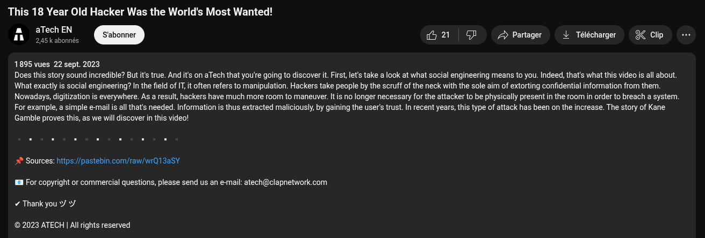

# Blitz CTF 2025 - OSINT Challenges: Hacked by Kids

This writeup covers two interconnected OSINT (Open Source Intelligence) challenges: "Hacked by Kids Part 1" and "Hacked by Kids Part 2". These challenges were a thrilling ride, huge thanks to B34RN00B & Zwique for authoring them!

---

## Hacked by Kids Part 1: Initial Infiltration

**Challenge Description:**


"Hacked by Kids Part 1" introduces us to a fascinating scenario: a group of young hackers infiltrating powerful individuals. Such an audacious act rarely goes unnoticed and would almost certainly garner massive media attention. This immediately pointed us towards a straightforward OSINT approach.

**Our Approach - A Simple Google Search:**

Our first step was, unsurprisingly, a basic Google search:


Bingo! A YouTube video surfaced, discussing the very case we were interested in. From this video, we quickly learned the hacker group's name: "Crackas With Attitude".

**Deepening the Search:**

With the group name in hand, another quick Google search was in order:


This led us directly to a press release from a US government website, detailing the sentencing of one of the group's members. Government websites are goldmines for juicy, verifiable information!


**The Flag:**

Within the official documents, we found the crucial piece of information needed to construct our flag.

```
Blitz{1:16-mj-406}
```


This concluded the first part of the challenge, setting the stage for an even deeper dive.

---

## Hacked by Kids Part 2: Locating the Elusive Hacker

**Challenge Description:**


Initially, I admit, I almost skipped "Hacked by Kids Part 2". With zero solves on the second day of the CTF, it looked daunting. But then, a hint appeared, tempting fate!


Let's dissect the hint:

> "Latest news: One of them infiltrated our server and attempted to deliver a message to everyone. They might have revealed their current location on one of the thousands of news sites. Locate that exact place on Google Maps and get what you looked for."

Breaking this down:

*   **"One of them infiltrated our server"**: This could mean the CTF website server or perhaps the CTF Discord server. Given the nature of CTFs, Discord seemed like a hot candidate.
*   **"attempted to deliver a message to everyone"**: If it's a web server, countless paths to check. If it's Discord, the options are more limited.
*   **"They might have revealed their current location on one of the thousands of news sites"**: This was the tricky part. Many news sites covered the "Crackas With Attitude" case (both British and American), but what did "revealed their current location" truly imply?
*   **"Locate that exact place on Google Maps and get what you looked for"**: Still a mystery, but pointed towards geographical data.

**Initial Misdirections (and a dash of humor):**

My first instinct was to inspect the source code of the official CTF website (`https://ctf.blitzhack.xyz/`), hoping for a hidden comment. Nada. So, naturally, I jumped to Discord. Because, you know, "server" > Discord. Makes sense, right?

**Discord Breakthrough:**

On the Discord server, a search for "Cracka" (our hacker's pseudonym) yielded an interesting result: an account named "Cracka" had joined on May 19, 2025—a full month *before* the CTF started! Highly suspicious.


Inspecting this "Cracka" account revealed a surprisingly rich bio. (Shout-out to the challenge authors for the first three troll links; finding "Never Gonna Give You Up" is always a sign you're on the right track!)


Crucially, the fourth link in the bio led to another YouTube video discussing the "Crackas With Attitude" case. And lo and behold, in the video description, a Pastebin link!



**The Pastebin Leads:**

The Pastebin contained five links to various news websites, all discussing the case and frequently mentioning Kane Gamble, one of the group members, whose pseudonym was indeed "Cracka".


**Where I Got Stuck (and Caffeinated):**

This is where I almost lost it. I spent about three hours and roughly 10 Tunisian Dinars on coffee, relentlessly trying to pinpoint Kane Gamble's house. After *extensive* research, I did find his arrested location, but it was, of course, blurred. Hours passed, and I was utterly stuck. My coffee addiction was growing, but the flag remained elusive.

Until... the coffee finally kicked in! I revisited one of the news websites and scrolled down to the comment section. And there he was! Cracka himself had posted a comment not long ago!


His comment read: *"I'm sitting in a restaurant right now, writing this comment, just trying to enjoy dinner — and they're already shutting down around me. At half past eight."*

**Dissecting Cracka's Comment:**

This was a goldmine of clues:

*   **"Now, I work as a Senior Security Consultant in my hometown."**: I already knew his hometown from previous research (I even had his home address, man!).
*   **"I'm sitting in a restaurant right now"**: Okay, a restaurant. That's a key location.
*   **"they're already shutting down around me. At half past eight."**: The restaurant closes at 8:30 PM.

So, our new target: a restaurant in his hometown that closes at 8:30 PM. This sounded much more manageable than finding a blurred house.

**The Crucial IP Address:**

Wait a minute! Did you spot the crucial detail I initially overlooked? The profile picture of Cracka on the news website had an IP address embedded: `93.93.223.188`.


What can one do with an IP address? Geolocation, of course! I used `https://whatismyipaddress.com/` and got the following results:


Copying these coordinates into Google Maps gave us the precise location:


**The Final Hunt - A Restaurant with a Deadline:**

Now, all that remained was to search for restaurants nearby this geolocated spot. But not just *any* restaurant—it had to be one that closed at 8:30 PM.


And we found it! With the restaurant identified, the last logical step was to check if Mr. Cracka, sitting in his hometown restaurant, might have left a review. And indeed, he did!


This was the moment I **BLOODED** this one (as in, got the flag in spectacular fashion)! Such a satisfying conclusion.

**The Flag:**

```
Blitz{C24ck45_W17h_A7717ud3_F0r3v3r}
```

---

These challenges were incredibly well-designed, forcing a deep dive into OSINT techniques and real-world investigation. A truly tough but rewarding experience! 